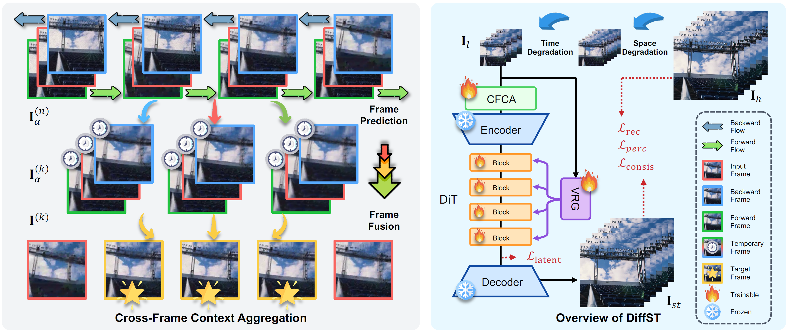
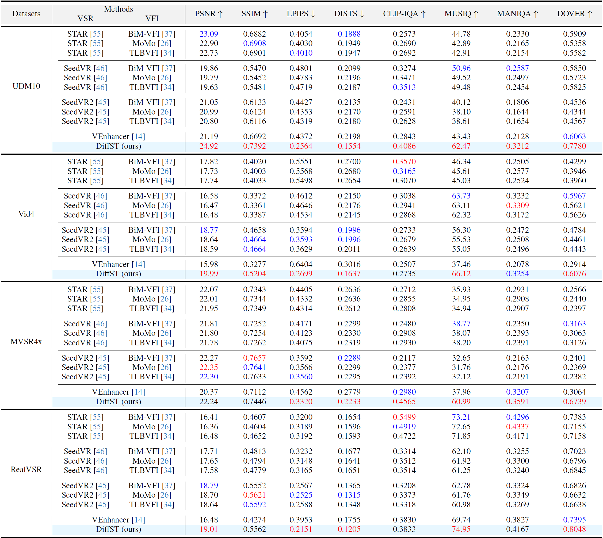
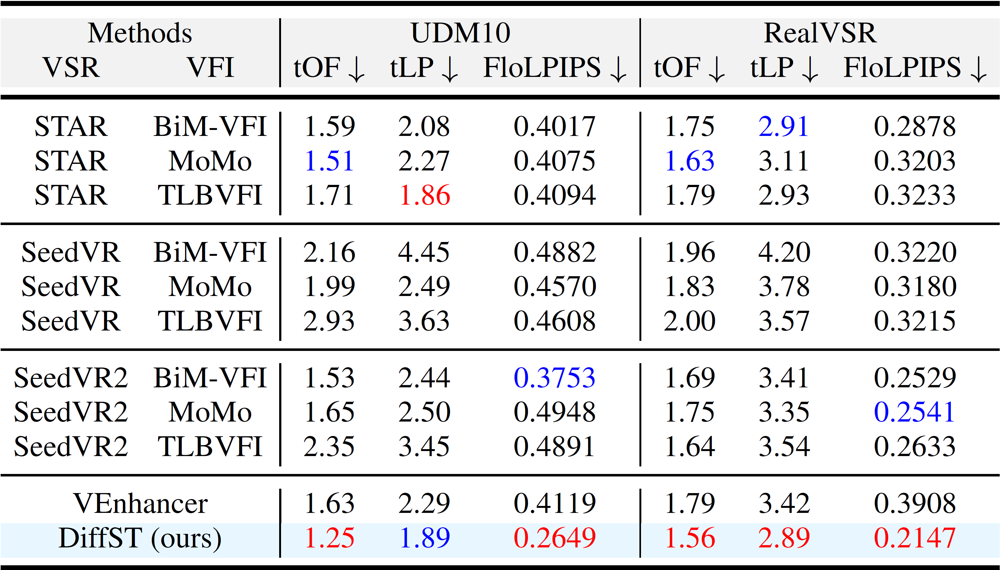
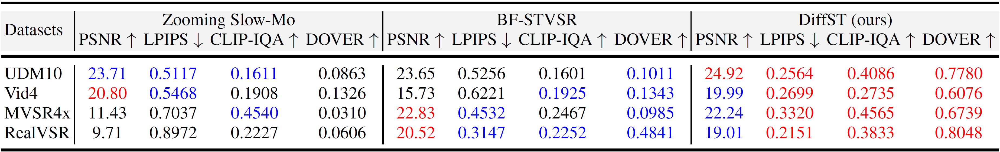
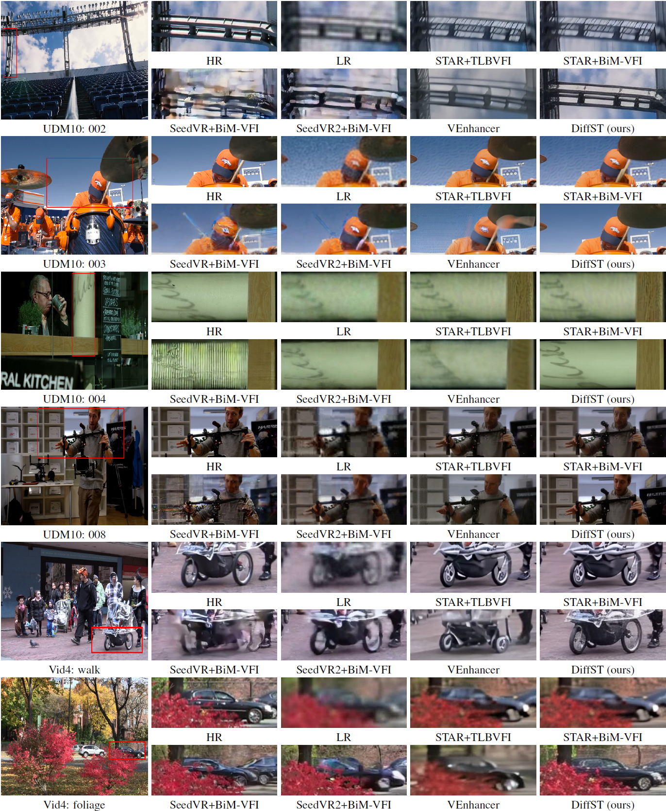
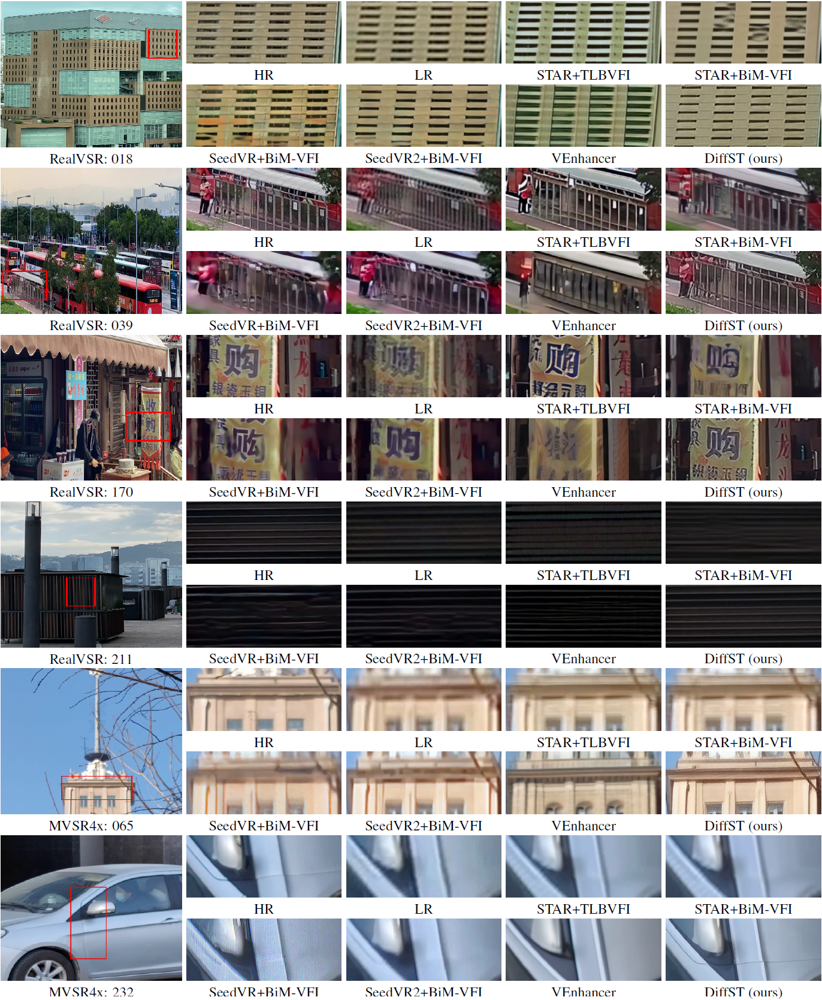

# DiffST: Difusión Consciente Espacio-Temporal para la Superresolución de Video Espacio-Temporal en el Mundo Real

[Zheng Chen](https://zhengchen1999.github.io/), [Ruofan Yang](https://github.com/RENLEILEI-Y), [Jin Han](), [Dehua Song](), [Zichen Zou](), [Chunming He](), [Yong Guo](), [Yulun Zhang](http://yulunzhang.com/), "DiffST: Difusión Consciente Espacio-Temporal para la Superresolución de Video Espacio-Temporal en el Mundo Real"

<div>
<a href="https://arxiv.org/abs/2605.13182" target="_blank" style="text-decoration: none;"></a>
<a href="https://github.com/zhengchen1999/DiffST" target='_blank' style="text-decoration: none;"></a>
<a href="https://github.com/zhengchen1999/DiffST/stargazers" target='_blank' style="text-decoration: none;"></a>
</div>

[[project](https://zheng-chen.cn/DiffST)] [[arXiv](https://arxiv.org/abs/2605.13182)]

#### 🔥🔥🔠 Novedades

- **2026-05-13:** Este repositorio se ha publicado. DiffST está disponible en arXiv.

---

> **Resumen:** Los modelos basados en difusión han demostrado un rendimiento sólido en la superresolución de video (VSR) y la interpolación de fotogramas de video (VFI). Sin embargo, su papel en el entorno acoplado de superresolución de video espacio-temporal (STVSR) sigue siendo limitado. Los enfoques STVSR basados en difusión existentes sufren de dos problemas: (1) baja eficiencia de inferencia y (2) uso insuficiente de la información espacio-temporal. Estas limitaciones dificultan su despliegue. Para abordar estos problemas, presentamos **DiffST**, un marco de difusión de video espacio-temporal-consciente y eficiente para STVSR en el mundo real. Para mejorar la eficiencia, adaptamos un modelo de difusión preentrenado para el muestreo en un solo paso y procesamos el video completo directamente, en lugar de operar en fotogramas individuales. Además, para mejorar el uso de la información espacio-temporal, introducimos la agregación de contexto entre fotogramas (CFCA) y la guía de representación de video (VRG). El módulo CFCA agrega información a través de múltiples fotogramas clave para generar fotogramas intermedios. El módulo VRG extrae características globales a nivel de video para guiar el proceso de difusión. Experimentos exhaustivos muestran que DiffST obtiene resultados líderes en tareas de STVSR del mundo real. También mantiene una alta eficiencia de inferencia, ejecutándose aproximadamente 17&times; más rápido que los métodos anteriores de STVSR basados en difusión.


## ⚒️ PENDIENTES

* [ ] Publicar el código y los modelos preentrenados

## 🔎 Descripción General del Método



## <a name="results"></a>🔎 Resultados

<details open>
<summary>Resultados Cuantitativos (haga clic para expandir)</summary>

- Resultados en la Tab. 4 del artículo principal

<p align="center">
  
</p>
<details>
<summary>Más Resultados Cuantitativos</summary>

- Más resultados en la Tab. 6 del material complementario

<p align="center">
  
</p>

- Más resultados en la Tab. 7 del material complementario

<p align="center">
  
</p>
</details>

<details open>
<summary>Resultados Cualitativos (haga clic para expandir)</summary>

- Resultados en la Fig. 7 del artículo principal

<p align="center">
  
</p>
<details>
<summary>Más Resultados Cualitativos</summary>

- Más resultados en la Fig. 7 del material complementario

<p align="center">
  
</p>

- Más resultados en la Fig. 8 del material complementario

<p align="center">
  
</details>

## <a name="citation"></a>📎 Citación

Si considera que el código es útil en su investigación o trabajo, por favor cite nuestro trabajo.

```
@article{chen2026diffst,
  title = {DiffST: Difusión Consciente Espacio-Temporal para la Superresolución de Video Espacio-Temporal en el Mundo Real},
  author = {Chen, Zheng and Yang, Ruofan and Han, Jin and Song, Dehua and Zou, Zichen and He, Chunming and Guo, Yong and Zhang, Yulun},
  journal = {arXiv preprint arXiv:2605.13182},
  year = {2026}
}
```


## <a name="acknowledgements"></a>💡 Agradecimientos

Este proyecto está basado en [Wan2.1](https://github.com/Wan-Video/Wan2.1).
